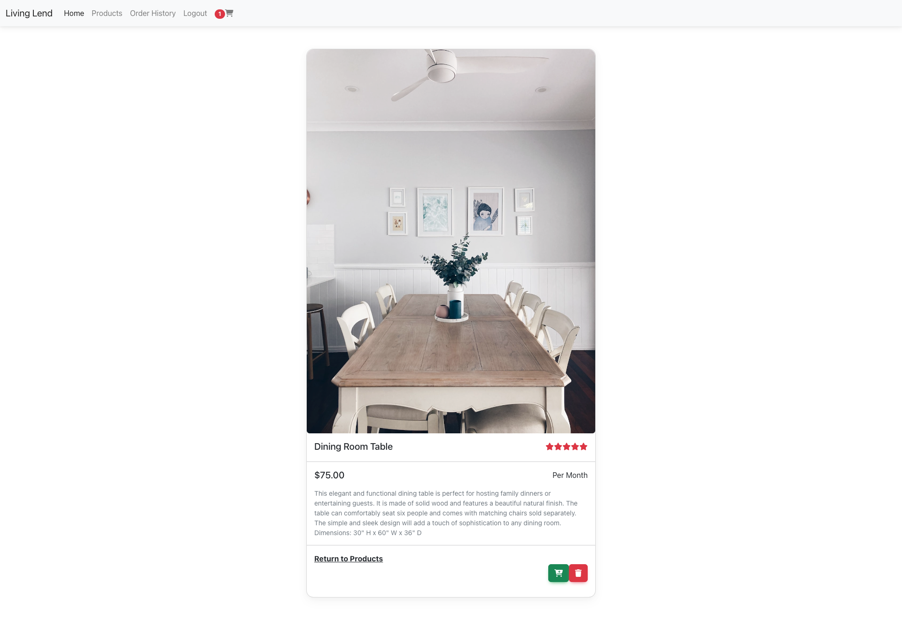

# Living Lend
## Description
Living Lend is a convenient and affordable solution for those who want to furnish their living spaces without the expense and hassle of purchasing furniture. With Living Lend, users can easily browse a wide selection of furniture styles and pieces, select the items they need, and choose a rental period that best suits their needs. Our rental periods are flexible, ranging from one month to several months, so users can rent furniture for as long as they need it.
Furthermore, by renting furniture, users can make a more sustainable choice. Renting furniture reduces waste and carbon emissions associated with the production and disposal of new furniture, making it a more environmentally-friendly option.

## Table of Contents
* [Installation](#installation)
* [Links](#links)
* [Usage](#usage)
* [License](#license)
* [Credits](#credits)
* [Contributors](#contributors)
* [Report Bugs](#bugreport)

## Installation
There are no installation requirements at this time.

## Links
Link to the deployed application
https://shielded-mesa-50681.herokuapp.com/
## Usage
- To begin using Living Lend, simply visit our website and create an account.
- Once you have an account, you can browse our inventory of furniture and select items to add to your cart.
- During checkout, you can select the rental period for each item, as well as any additional services such as delivery and assembly.
- After your order is confirmed, our team will deliver and set up your furniture at your designated location.
- When your rental period is over, we will pick up the furniture at your convenience.

### Application Screenshot:
 
## License 
   

  [Read more about MIT License here.](https://opensource.org/licenses/MIT)
  
## Credits
- Font - Courtesy of [Google Fonts.](https://fonts.google.com)
- Fontend Toolkit - Courtesy of [MDBootstrap.](https://mdbootstrap.com/)
- Stripe Integration - Courtesy of [Columbia Bootcamp.](https://bootcamp.cvn.columbia.edu/coding/landing-ftpt-b5a/?s=Google-Brand_Tier-1_&dki=Learn%20Coding&pkw=columbia%20coding%20bootcamp&pcrid=471112563095&pmt=e&utm_source=google&utm_medium=cpc&utm_campaign=GGL%7CCOLUMBIA-UNIVERSITY%7CSEM%7CCODING%7C-%7COFL%7CTIER-1%7CALL%7CBRD%7CEXACT%7CCore%7CBootcamp&utm_term=columbia%20coding%20bootcamp&s=google&k=columbia%20coding%20bootcamp&utm_adgroupid=111599970195&utm_locationphysicalms=9067609&utm_matchtype=e&utm_network=g&utm_device=c&utm_content=471112563095&utm_placement=&gclid=CjwKCAjwiOCgBhAgEiwAjv5whLoRk3k1UBd7cwZv85pYUm9qJx3XUpW8-F8q1yz_QBfjfeVu9AXPRBoCkEYQAvD_BwE&gclsrc=aw.ds)

## Contributors
Here are the web developers for Phantom plates that contributed to this project: 
- Cheneia Davis [Github](https://github.com/Ndvschen8)
- Caleb Ernst [Github](https://github.com/caernst13)
- Steven McCombe  [Github](https://github.com/Steven-McCombe)
## BugReport
- [E-mail Bug Report](mailto:bugreport@livinglend.com)

